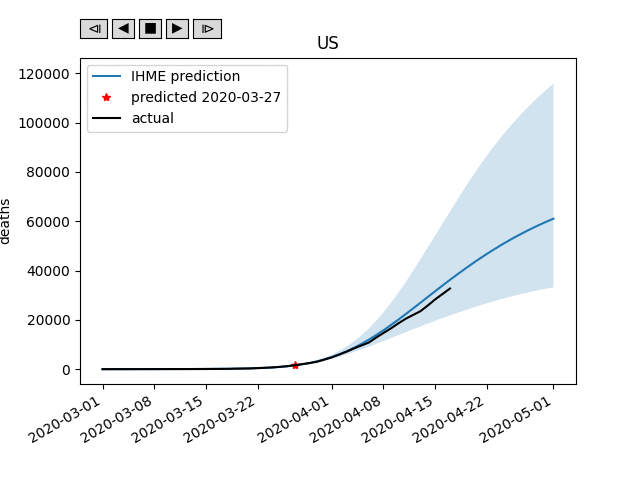

# ihme_covproj_test
Plots IHME's COVID-19 deaths projections for different locations and dates vs actuals, to see how well they did.

```
Usage: python draw_proj_vs_time.py (-s) [location]
  -s : save an animated gif instead of running interactively
Note: if the location name has a space, enclose the name in quotes.
Example: python draw_proj_vs_time.py "New York"
```

Example output gif:



To update with future IHME data, download their data from http://www.healthdata.org/covid/data-downloads and unpack it in the data directory.

Uses the "Player" class posted here for interactive drawing:
https://stackoverflow.com/questions/44985966/managing-dynamic-plotting-in-matplotlib-animation-module
